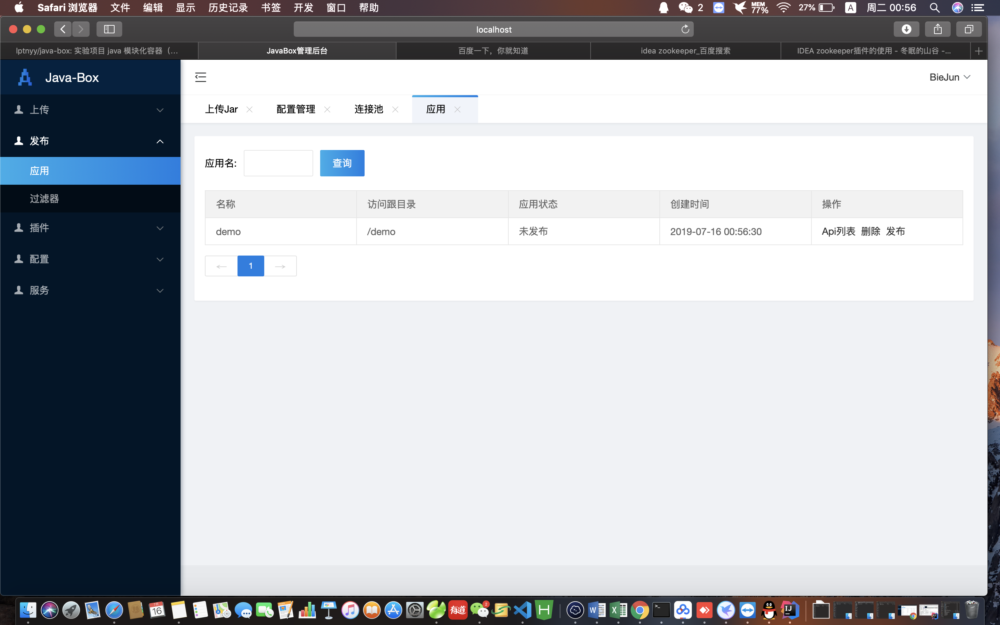

# Java-Box（盒子）大demo 只是实现自己的思路而写 
    写一个程序送给自己，如果大家有兴趣我们可以一起玩 QQ174047244 联系我 请写好备注，
    在公司工作后期硬顶着压力做了一段时间架构（这部分还算新手但顶住了),我觉得最恶心的部分就是发布版本，
    每次发版都要经历一次发版流程劳命伤财，同时公司做线上活动都是突然提出需求，公司的项目在初期就是集中式架构写的特别多都乱了，
    其他我就不说了都是眼泪哭了快一年，我借鉴了阿里云的函数计算以及osgi, 阿里云的函数计算是好东西，但我感觉应该是靠k8s动态创建容器弄出来的（猜测）
    因为是阿里的产品，收费并且耦合大了对公司项目来说也不是什么好事，osgi太大不可能切上去，所以我就构思了这个框架，让所有的接口服务热加载，支持动态插拔的
    能力，并且支持业务直接线上测试，我也不需要那种劳命伤财的发版，做到随时用随时上，随时下能力，我觉得做活动很实用，或者小程序方面。
# 项目业务图
 

# 后台管理

# 项目开发部分
代码案例 接口服务编写 （项目 java-box-dev 代码案例） 
编写接口
<pre>
    <code>
package com.demo;
import com.alibaba.fastjson.JSON;
import com.demo.sql.BoxUser;
import com.demo.sql.UserDao;
import com.wzy.func.annotation.BoxApi;
import com.wzy.func.annotation.BoxApp;
import com.wzy.func.annotation.BoxSetBean;
import com.wzy.func.fc.IBoxCache;
import com.wzy.func.fc.IBoxDataSource;
import javax.servlet.http.HttpServletRequest;
import javax.servlet.http.HttpServletResponse;
import javax.sql.DataSource;
import java.io.IOException;
import java.io.PrintWriter;
import java.sql.Connection;
import java.sql.SQLException;
import java.util.List;
@BoxApp(name = "demo", path = "/demo")
public class UserZdyWork {

    @BoxSetBean(value = "com.wzy.plug.db.druid.BoxDruidDataSource")  // 动态载入开发的插件数据库链接池
    IBoxDataSource boxDataSource;

    @BoxSetBean(value = "com.wzy.plug.ceche.redis.BoxRedisCacheSource") // 动态载入开发的redis插件
    IBoxCache boxCache;

    @BoxApi(name = "mysql", path = "/sql")
    public boolean demo(HttpServletRequest request, HttpServletResponse response) {
        DataSource dataSource = boxDataSource.dataSource();
        try {
            Connection connection = dataSource.getConnection();
            UserDao userDao = new UserDao();
            List<BoxUser> users =userDao.getUserList(connection);
            printJson(response,JSON.toJSONString(users));
        } catch (SQLException e) {
            e.printStackTrace();
        }
        return true;
    }

    @BoxApi(name = "redis", path = "/nosql")
    public boolean demo1(HttpServletRequest request, HttpServletResponse response) {
        try {
            boxCache.set("keys","123");
            printJson(response,boxCache.get("keys"));
        } catch (Exception e) {
            e.printStackTrace();
        }
        return true;
    }

    private void printJson(HttpServletResponse response, String jsonStr){
        try {
            PrintWriter out = response.getWriter();
            out.print(jsonStr);
            out.close();
        } catch (IOException e) {
            e.printStackTrace();
        }
    }
}
    </code>
</pre> 
编写拦截器
<pre>
    <code>
package com.demo;
import com.wzy.func.fc.IHttpWorkFilter;
import com.wzy.func.annotation.BoxWorkFilter;
import javax.servlet.http.HttpServletRequest;
import javax.servlet.http.HttpServletResponse;

@BoxWorkFilter(name = "测试过滤器", path = "/demo/*")
public class TestWorkFilter implements IHttpWorkFilter {

    @Override
    public boolean service(HttpServletRequest request, HttpServletResponse response) {
        System.out.println("调用前拦截一下");
        return true;
    }
}
        
    </code>
</pre> 
编写插件（redis  java-box-plug 项目） 
<pre>
    <code>
package com.wzy.plug.ceche.redis;

import com.wzy.func.annotation.BoxBean;
import com.wzy.func.annotation.BoxBeanType;
import com.wzy.func.annotation.BoxConfigAdds;
import com.wzy.func.fc.IBoxCache;
import com.wzy.func.fc.IBoxClose;
import com.wzy.func.fc.IBoxInit;
import com.wzy.func.fc.IConfig;
import com.wzy.log.BoxLog;
import com.wzy.log.ILog;
import redis.clients.jedis.Jedis;
import redis.clients.jedis.JedisPool;
import redis.clients.jedis.JedisPoolConfig;

@BoxBean(type = BoxBeanType.SINGLE_OBJECT)
// 自动将配置文件信息存放到zk中
@BoxConfigAdds(configs = {
        "redis_timeout=3000",
        "redis_passWord=",
        "redis_maxWait=1500",
        "redis_maxActive=100",
        "redis_testOnReturn=true",
        "redis_maxIdle=50",
        "redis_testOnBorrow=true",
        "redis_ip=192.168.30.199",
        "redis_port=6379"
})
public class BoxRedisCacheSource implements IBoxCache, IBoxInit, IBoxClose {
    ILog log = BoxLog.getInstance();

    @Override
    public String get(String key) {
        Jedis jedis = null;
        try {
            jedis = getJedis();
            return jedis.get(key);
        } catch (Exception e){
            log.error(e);
        } finally {
            returnResource(jedis);
        }
        return null;
    }

    @Override
    public String set(String key, String value) {
        Jedis jedis = null;
        try {
            jedis = getJedis();
            return jedis.set(key,value);
        } catch (Exception e){
            log.error(e);
        } finally {
            returnResource(jedis);
        }
        return null;
    }

    @Override
    public String setEx(String key, String value, Integer second) {
        Jedis jedis = null;
        try {
            jedis = getJedis();
            return jedis.setex(key,second,value);
        } catch (Exception e){
            log.error(e);
        } finally {
            returnResource(jedis);
        }
        return null;
    }

    @Override
    public String hget(String hkey, String key) {
        Jedis jedis = null;
        try {
            jedis = getJedis();
            return jedis.hget(hkey,key);
        } catch (Exception e){
            log.error(e);
        } finally {
            returnResource(jedis);
        }
        return null;
    }

    @Override
    public void hset(String hkey, String key, String value) {
        Jedis jedis = null;
        try {
            jedis = getJedis();
            jedis.hset(hkey,key,value);
        } catch (Exception e){
            log.error(e);
        } finally {
            returnResource(jedis);
        }
    }

    @Override
    public boolean hsetEx(String hkey, String key, String value, Integer second) {
        Jedis jedis = null;
        try {
            jedis = getJedis();
            jedis.hset(hkey,key,value);
            jedis.expire(hkey, second);
            return true;
        } catch (Exception e){
            log.error(e);
        } finally {
            returnResource(jedis);
        }
        return false;
    }

    @Override
    public long incr(String key, Integer num) {
        Jedis jedis = null;
        try {
            jedis = getJedis();
            return jedis.incrBy(key,num);
        } catch (Exception e){
            log.error(e);
        } finally {
            returnResource(jedis);
        }
        return 0;
    }

    @Override
    public boolean expire(String key, Integer second) {
        Jedis jedis = null;
        try {
            jedis = getJedis();
            jedis.expire(key,second);
            return true;
        } catch (Exception e){
            log.error(e);
        } finally {
            returnResource(jedis);
        }
        return false;
    }

    @Override
    public void del(String key) {
        Jedis jedis = null;
        try {
            jedis = getJedis();
            jedis.del(key);
        } catch (Exception e){
            log.error(e);
        } finally {
            returnResource(jedis);
        }
    }

    @Override
    public long hdel(String hkey, String key) {
        Jedis jedis = null;
        try {
            jedis = getJedis();
            jedis.hdel(hkey,key);
        } catch (Exception e){
            log.error(e);
        } finally {
            returnResource(jedis);
        }
        return 0;
    }

    @Override
    public boolean exists(String key) {
        Jedis jedis = null;
        try {
            jedis = getJedis();
            return jedis.exists(key);
        } catch (Exception e){
            log.error(e);
        } finally {
            returnResource(jedis);
        }
        return false;
    }

    @Override
    public Object[] keys(String key) {
        Jedis jedis = null;
        try {
            jedis = getJedis();
            return jedis.keys(key).toArray();
        } catch (Exception e){
            log.error(e);
        } finally {
            returnResource(jedis);
        }
        return new Object[0];
    }

    @Override
    public void close() throws Exception {
        jedisPool.close();
    }

    private JedisPool jedisPool = null;

    @Override
    public void init(IConfig config) throws Exception {
        int redis_timeout= Integer.valueOf(config.getValue("redis_timeout"));
        String redis_passWord= config.getValue("redis_passWord");
        int redis_maxWait= Integer.valueOf(config.getValue("redis_maxWait"));
        int redis_maxActive= Integer.valueOf(config.getValue("redis_maxActive"));
        Boolean redis_testOnReturn= Boolean.valueOf(config.getValue("redis_testOnReturn"));
        int redis_maxIdle = Integer.valueOf(config.getValue("redis_maxIdle"));
        Boolean redis_testOnBorrow= Boolean.valueOf(config.getValue("redis_testOnBorrow"));
        String redis_ip = config.getValue("redis_ip");
        int redis_port = Integer.valueOf(config.getValue("redis_port"));
        JedisPoolConfig jedisPoolConfig = new JedisPoolConfig();
        // 设置最大连接数
        jedisPoolConfig.setMaxTotal(redis_maxActive); // 可以创建3000jedis实例 
        // 设置最大空闲连接数
        jedisPoolConfig.setMaxIdle(redis_maxIdle);
        //等待可用连接的最大时间
        jedisPoolConfig.setMaxWaitMillis(redis_maxWait);
        //在borrow一个jedis实例时，是否提前进行validate操作；如果为true，则得到的jedis实例均是可用的
        jedisPoolConfig.setTestOnBorrow(redis_testOnBorrow);
        jedisPoolConfig.setTestOnReturn(redis_testOnReturn);
        if (redis_passWord == null || redis_passWord.equals(""))
            jedisPool = new JedisPool(jedisPoolConfig,redis_ip,redis_port,redis_timeout);
        else {
            jedisPool = new JedisPool(jedisPoolConfig,redis_ip,redis_port,redis_timeout,redis_passWord);
        }
        log.info("redis成功");
    }

    /**
     * 获取Jedis实例
     * 每次用完要将连接返回给连接池 jedis.close();
     */
    public Jedis getJedis(){
        if(jedisPool != null){
            Jedis resource = jedisPool.getResource();
            return resource;
        }else{
            return null;
        }
    }

    /** 
      * 回收Jedis对象资源 
      *     - 用户redis都要使用该方法释放资源, 否则一直占有实例资源
      * 
      * @param jedis 
      */
     public synchronized void returnResource(Jedis jedis){
        if(jedis != null){
            jedisPool.returnResource(jedis);
        }
     }

    @Override
    public void init() throws Exception {

    }
}        
    </code>
</pre> 
编写插件（阿里连接池）
<pre>
    <code>
package com.wzy.plug.db.druid;
import com.alibaba.druid.pool.DruidDataSource;
import com.wzy.func.annotation.BoxBean;
import com.wzy.func.annotation.BoxBeanType;
import com.wzy.func.annotation.BoxConfigAdds;
import com.wzy.func.fc.IBoxClose;
import com.wzy.func.fc.IBoxDataSource;
import com.wzy.func.fc.IBoxInit;
import com.wzy.func.fc.IConfig;
import com.wzy.log.BoxLog;
import com.wzy.log.ILog;
import javax.sql.DataSource;
import java.util.Map;

@BoxConfigAdds(
        configs= {
                "druidurl=jdbc:mysql://localhost:3306/java_box?useUnicode=true&characterEncoding=utf-8",
                "druidusername=root",
                "druidpassword=wangyang",
                "druiddriverClassName=com.mysql.jdbc.Driver",
                "druidinitialSize=5",
                "druidminIdle=5",
                "druidmaxActive=20",
                "druidmaxWait=60000",
                "druidtimeBetweenEvictionRunsMillis=60000",
                "druidminEvictableIdleTimeMillis=300000",
                "druidvalidationQuery=SELECT 'x'",
                "druidtestWhileIdle=true",
                "druidtestOnBorrow=false",
                "druidtestOnReturn=false",
                "druidpoolPreparedStatements=true",
                "druidmaxPoolPreparedStatementPerConnectionSize=20",
                "druidconnectionProperties=druid.stat.mergeSql=true;druid.stat.slowSqlMillis=5000"
        }
        )
@BoxBean(type = BoxBeanType.SINGLE_OBJECT)
public class BoxDruidDataSource implements IBoxDataSource, IBoxInit, IBoxClose {
    ILog log = BoxLog.getInstance();
    DruidDataSource datasource;

    public DataSource dataSource() {
        return datasource;
    }

    @Override
    public Map<String, DataSource> dataSources() {
        return null;
    }

    // 初始化连接池
    @Override
    public void init(IConfig config) throws Exception {
        String url = config.getValue("druidurl");
        String username = config.getValue("druidusername");
        String password = config.getValue("druidpassword");
        String driverClassName = config.getValue("druiddriverClassName");
        int initialSize = Integer.valueOf(config.getValue("druidinitialSize"));
        int minIdle = Integer.valueOf(config.getValue("druidminIdle"));
        int maxActive = Integer.valueOf(config.getValue("druidmaxActive"));
        int maxWait = Integer.valueOf(config.getValue("druidmaxWait"));
        int timeBetweenEvictionRunsMillis = Integer.valueOf(config.getValue("druidtimeBetweenEvictionRunsMillis"));
        int minEvictableIdleTimeMillis = Integer.valueOf(config.getValue("druidminEvictableIdleTimeMillis"));
        String validationQuery = config.getValue("druidvalidationQuery");
        boolean testWhileIdle = Boolean.valueOf(config.getValue("druidtestWhileIdle"));
        boolean testOnBorrow = Boolean.valueOf(config.getValue("druidtestOnBorrow"));
        boolean testOnReturn = Boolean.valueOf(config.getValue("druidtestOnReturn"));
        boolean poolPreparedStatements = Boolean.valueOf(config.getValue("druidpoolPreparedStatements"));
        int maxPoolPreparedStatementPerConnectionSize = Integer.valueOf(config.getValue("druidmaxPoolPreparedStatementPerConnectionSize"));
        String connectionProperties = config.getValue("druidconnectionProperties");
        datasource = new DruidDataSource();
        datasource.setUrl(url);
        datasource.setUsername(username);
        datasource.setPassword(password);   //这里可以做加密处理
        datasource.setDriverClassName(driverClassName);
        datasource.setInitialSize(initialSize);
        datasource.setMinIdle(minIdle);
        datasource.setMaxActive(maxActive);
        datasource.setMaxWait(maxWait);
        datasource.setTimeBetweenEvictionRunsMillis(timeBetweenEvictionRunsMillis);
        datasource.setMinEvictableIdleTimeMillis(minEvictableIdleTimeMillis);
        datasource.setValidationQuery(validationQuery);
        datasource.setTestWhileIdle(testWhileIdle);
        datasource.setTestOnBorrow(testOnBorrow);
        datasource.setTestOnReturn(testOnReturn);
        datasource.setPoolPreparedStatements(poolPreparedStatements);
        datasource.setMaxPoolPreparedStatementPerConnectionSize(maxPoolPreparedStatementPerConnectionSize);
        datasource.setConnectionProperties(connectionProperties);
        log.info("阿里云链接池 成功");
    }

    @Override
    public void init() throws Exception {

    }

    @Override
    public void close() throws Exception {
        datasource.close();
    }
}  
    </code>
</pre> 
打成普通jar包（自定义依赖包也要打入） 
 
# 发布项目
（1）首先启动java-box-api-service 接着启动 java-box-spring-boot （在这个服务访问接口） 
（2）在首页首先上传 插件包 检查配置信息 
 
（3）检查配置插件包上传的配置信息, 配置信息有问题直接修改 
 
（4）在首页上传 api接口服务jar 然后发布服务 直接访问服务就可以 
 
 
发布api 
 
下架api 
 

此后只需要开发对应的jar包 提交上传发布就可以 不需要重启服务 更不需要停机 
同时集群发布的时候 java-box-spring-boot 也不需要你往里面部署程序，它会重新在管理端拉去所有jar载入 提供同样的服务  
 
# 工程结构
项目实用到的中间件 zookeeper 利用zk做注册中心，配置中心，订阅
  
数据库 mysql
 
java-box-dev  开发打包jar模块
 
java-box-server 用netty编写的服务（不推荐）
 
java-box-util 项目工具包
 
java-box-api-service 容器管理后台
 
java-box-spring-boot 将动态加载嵌入到 Spring boot 当中 让spring boot 具有动态加载的能力（推荐）